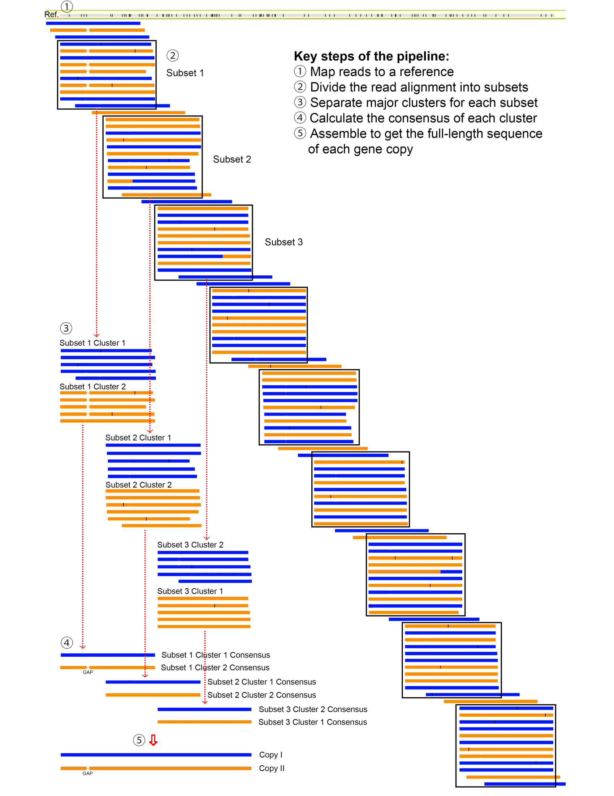
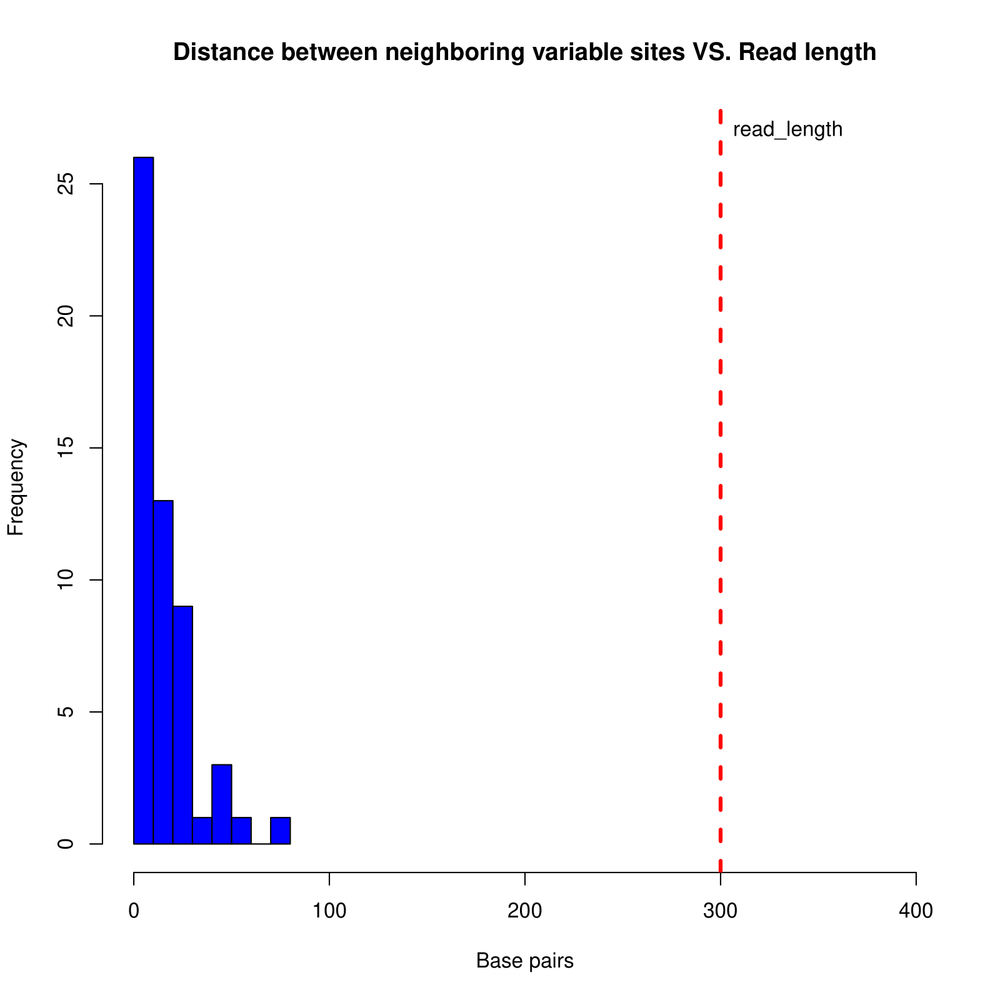

---
title: 'copyseparator: An R package for assembling long gene copies from short read data'
tags:
  - gene family
  - Next-Generation Sequencing
  - phasing
  - polyploidy
  - short reads
  
authors:
  - name: Lei Yang
    orcid: 0000-0002-5644-7480
    equal-contrib: false
    affiliation: 1
  - name: Gavin J.P. Naylor
    orcid: 0000-0002-8731-2626
    equal-contrib: false
    affiliation: 1

affiliation:
 - name: Florida Museum of Natural History, 1659 Museum Rd. University of Florida, Gainesville, Florida 32611, USA
   index: 1
date: 15 December 2022
bibliography: paper.bib

# Summary
copyseparator is an R package designed to separate and assemble short read data into their corresponding long gene copies. The package takes as input short (>= 250 bp) Next-Generation Sequencing (NGS) reads from PCR amplicons or targeted gene capture. It has been designed to identify and accurately reconstruct gene copies from polyploids, gene families, mixed/contaminated samples etc. It is most effective in situations where there are few (e.g. two) gene copies. copyseparator can assemble very long gene copies when variation is spread evenly along the gene sequence (i.e there are no long invariable runs) and the coverage is high and relatively even. Short indels in gene copies seem have little impact on the efficacy of the assembly process.

# Statement of need
Gene duplication has long been recognized as a major evolutionary force [@Ohno:1970]. Over the years, many different approaches have been used to separate multiple gene copies [@Rothfels:2017; @Rothfels:2021]. These approaches can be grouped into at least four major types: 1) PCR amplicon cloning (e.g. [@Evans:2005; @Yang:2015; @Yang:2022]); 2) Using copy-specific primers (e.g. [@Gante:2011]); 3) Single-molecule PCR (e.g. [@Marcussen:2012]); 4) Next-Generation Sequencing or third-generation sequencing followed by data phasing (e.g. [@Rothfels:2017]). In the past, the first approach, which is tedious, has been most frequently used by researchers. Approaches in the last type were not available until about a decade ago. They are based on several different sequencing platforms (e.g. Roche 454, Illumina, and PacBio). Various pipelines have been developed to sort and assemble multiple gene copies from large amounts of short or long sequencing reads (e.g. [@Rothfels:2017; @Kates:2018]). Approaches based on short-read sequencing technologies need to sort sequencing reads according to their subgenome-of-origin and assemble the reads into different gene copies. Approaches using long-read sequencing technologies (e.g. PacBio) are still too expensive for processing large number of samples, even though they do not have to contend with the assembly problem. Functions in the R package copyseparator can assemble short read data into long gene copies at a high successful rate. It requires the read length to be 300bp or 250bp, which are currently at the upper end of the short-read sequencing technologies, to minimize the chance of producing chimeric sequences. As far as we know, no R package using the similar assembling pipeline has been published to date. 

# Key functions
1. sep_assem
This function separates two or more gene copies from short-read Next-Generation Sequencing data into a small number of overlapping DNA sequences and assemble them into their respective gene copies. After the reads are mapped to a reference using Geneious or other software (\autoref{fig:1}; Step 1), sep_assem performs all tasks from Step 2 to Step 5 in Fig. 1 to get the full-length sequence of each gene copy.

2. copy_validate
This function helps to identify incorrectly assembled chimeric sequences. After the Step 5 in Fig. 1, copy_validate can be used to analyze the assembled gene copies and returns a histogram in pdf format showing the relationships between the physical distance between neighboring variable sites and read length (\autoref{fig:2}). If the physical distance between any neighboring variable sites is larger than the read length, the input sequences are likely chimeric.

# Implementation
copyseparator is available on CRAN (https://cran.r-project.org/web/packages/copyseparator/index.html). It can process many input samples (i.e. fasta files containing short-read sequencing data mapped to a reference) one after another using multiple CPU cores for each sample. After the run for a sample is finished, the final assembling results and some intermediate files are placed in one folder named after that sample. We have tested copyseparator on NGS sequenced PCR amplicons (800-1500bp) of dozens of polyploid fishes (mainly tetraploids). In most cases, it returns the anticipated number of correctly assembled gene copies. Depending on the complexity of short read data, it is sometimes necessary, after the run of sep_assem finishes, to make edits suggested by the software to the intermediate file (un-assembled sequence alignment) and redo the assembling using copy_assemble. The design of the pipeline used by copyseparator allows one to accurately assemble gene copies that are very long. Theoretically, it works as long as the gene copies do not have too long a region that is invariable and the coverage is adequate across the entire length of the gene copies. We have used copyseparator to successfully assemble mitogenomes (~16,000 bp) of two shark species, whose reads (from gene capture, paired-end, read length 300bp) have been combined intentionally.

# Acknowledgements
This work was supported by the National Science Foundation (DEB 1541556 to G.J.P.N.).

# Figures

Key steps of the pipeline used by copyseparator to assemble long gene copies from short read data. First, short reads are mapped to a reference (Step 1). Reads that are not directly mapped to the reference and the reference itself need to be removed after mapping. Second, the large read alignment is divided into multiple (9 in this figure) subsets that have significant overlaps between neighboring subsets (Step 2). After that, sequences that are empty or too short are removed. Each bar, either blue or orange, showed in this figure may represent dozens or even hundreds of reads in reality. From Step 3 to Step 5, the first three subsets are used to illustrate how to get the full length of each gene copy. We first separate major clusters for each dataset (Step 3). We then calculate to get the consensus sequence for each cluster of each subset (Step 4). At last, we assemble the sequences from the last step to get the full-length sequence of each gene copy (Step 5). As can be seen from the figure, the number of subsets can be a large number and the full length of each gene copy can thus be very long. Short indels in gene copies seem have no impact on the assembling process.

Example of an output plot of the function copy_validate showing relationships between the physical distance between neighboring variable sites and read length.